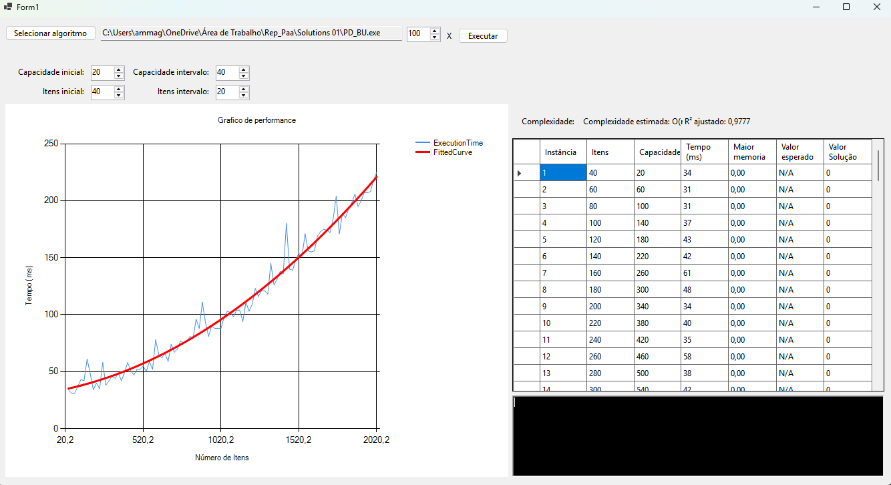

# Análise do Problema da Mochila 0-1

Este repositório contém o projeto final da disciplina de **Projeto e Análise de Algoritmos (PAA)**, ministrada pelo Prof. Walisson Ferreira de Carvalho na PUC Minas. O trabalho consiste em uma pesquisa teórica e experimental sobre o **Problema da Mochila 0-1**, um problema clássico de otimização e NP-Completo.

O projeto inclui:
* Um **artigo científico** no padrão da SBC, localizado na pasta `/Latex`.
* A **apresentação de slides** utilizada na exposição do trabalho, na pasta `/presentation`.
* Uma **ferramenta de análise experimental** (`KPack01_Analyzer`) desenvolvida em C# para validar empiricamente a complexidade dos algoritmos.

## A Ferramenta de Análise Experimental

Para realizar a análise prática, desenvolvemos uma aplicação de desktop em C# (.NET 8) com Windows Forms. A ferramenta funciona como uma bancada de testes automatizada para algoritmos que solucionam o Problema da Mochila 0-1.



### Funcionalidades Principais
* **Motor de Execução:** Permite carregar e executar qualquer algoritmo compilado (`.exe`) externamente.
* **Gerador de Instâncias:** Cria cenários de teste aleatórios, permitindo configurar o crescimento do número de itens e da capacidade da mochila para análises de escalabilidade.
* **Execução em Lote:** Automatiza a execução de múltiplas instâncias em sequência.
* **Coleta de Métricas:** Mede e registra automaticamente o tempo de execução (em milissegundos) e o pico de uso de memória RAM (em Megabytes) para cada execução.
* **Visualização de Dados:** Apresenta os resultados em tempo real em uma tabela detalhada e em um gráfico de performance (Itens vs. Tempo).

## Como Utilizar a Ferramenta

1.  **Pré-requisito:** Você precisa de um algoritmo compilado em um arquivo `.exe` que resolva o Problema da Mochila 0-1 e que aceite os parâmetros de entrada via linha de comando (veja a estrutura abaixo).
2.  **Passo 1: Selecionar o Algoritmo:** Use o botão "Selecionar algoritmo" para carregar o seu arquivo `.exe`.
3.  **Passo 2: Configurar a Geração:** Defina os parâmetros nos campos da interface:
    * **Capacidade inicial e Itens iniciais:** Valores de partida para a primeira execução.
    * **Capacidade intervalo e Itens intervalo:** O valor a ser somado a cada nova instância, para observar o crescimento.
    * **Número de execução:** Quantas vezes o algoritmo será executado em sequência.
4.  **Passo 3: Executar a Análise:** Clique no botão "Executar". A ferramenta iniciará o processo, preenchendo a tabela e o gráfico em tempo real. Ao final, a análise de curva será exibida.

### Estrutura dos Parâmetros para o `.exe`
A ferramenta foi projetada para interagir com executáveis que esperam uma estrutura de argumentos específica. É crucial que seu algoritmo em C++ (ou outra linguagem) esteja preparado para ler os `args` da seguinte forma:

**Formato Esperado (Argumentos separados por espaço):**
```
<programa.exe> [capacidade] [numero_de_itens] [lista_de_itens]
```
* `argv[1]`: Um inteiro representando a **Capacidade (W)** da mochila.
* `argv[2]`: Um inteiro representando o **Número de Itens (n)**.
* `argv[3]`: Uma única string contendo todos os itens, onde cada item é um par `valor,peso` e os pares são separados por `;`.
    * **Exemplo de `argv[3]`:** `"50,10;120,30;80,25"`

**Formato da Saída Esperada:**
Para que a ferramenta possa capturar o resultado, o seu `.exe` deve imprimir na saída padrão (`stdout`) uma linha contendo o valor final da solução no seguinte formato:
```
Valor Solucao: 12345
```

## Limitações
* A ferramenta é uma **analisadora**, ela não implementa os algoritmos de solução, apenas os executa e mede sua performance.
* A análise de complexidade é **experimental**, baseada nos dados de tempo/memória, e não uma prova matemática formal.
* A estrutura de passagem de parâmetros é fixa e específica para o Problema da Mochila 0-1 como descrito acima.

## Tecnologias Utilizadas
* **Linguagem da Ferramenta:** C# (.NET 8)
* **Interface:** Windows Forms
* **Biblioteca de Análise:** Math.NET Numerics, System.Diagnostics
* **Algoritmos:** C++ (compilados com MinGW g++)

## Autores
* Alberto Magno
* Josué Pereira Nogueira
* Leonardo Henrique Saraiva de Avelar